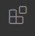

# Installazione 
Avremo bisogno di rustup per iniziare, è lo strumento che permette di gestire le versioni del compilatore e altri tool
Andate su questo link e seguite le istruzioni: https://rustup.rs/
Per linux e mac-os basta eseguire questo comando: `curl --proto '=https' --tlsv1.2 -sSf https://sh.rustup.rs | sh`

Ora basta seguire le istruzioni su schermo, consiglio di installare l'ultima versione standard nella posizione di default, ma se avete una buona ragione potete anche personalizzarlo

Ora dovreste poter eseguire `rustup -V` e dovreste avere un output simile a:
```
rustup 1.26.0 (5af9b9484 2023-04-05)
info: This is the version for the rustup toolchain manager, not the rustc compiler.
info: The currently active `rustc` version is `rustc 1.75.0 (82e1608df 2023-12-21)
``` 
e `cargo -V`, ottenendo come output:
```
cargo 1.75.0 (1d8b05cdd 2023-11-20)
``` 

# Installare e configurare vscode:

Potete usare l'ide che volete, ma noi vi consigliamo vscode con l'estensione per rust (veloce, leggero, gratis, e con il 95% delle funzionalità degli altri ide).
Per installare vscode con un package manager basato su snap, potete eseguire:
`sudo snap install --classic code`, altrimenti potete seguire le indicazioni qui https://code.visualstudio.com/Download

Una volta installato, potete aprirlo, e andare sul menù delle estensioni:

, e installate "rust analyzer".

Terminati questi passaggi siete pronti per passare alla lezione 2