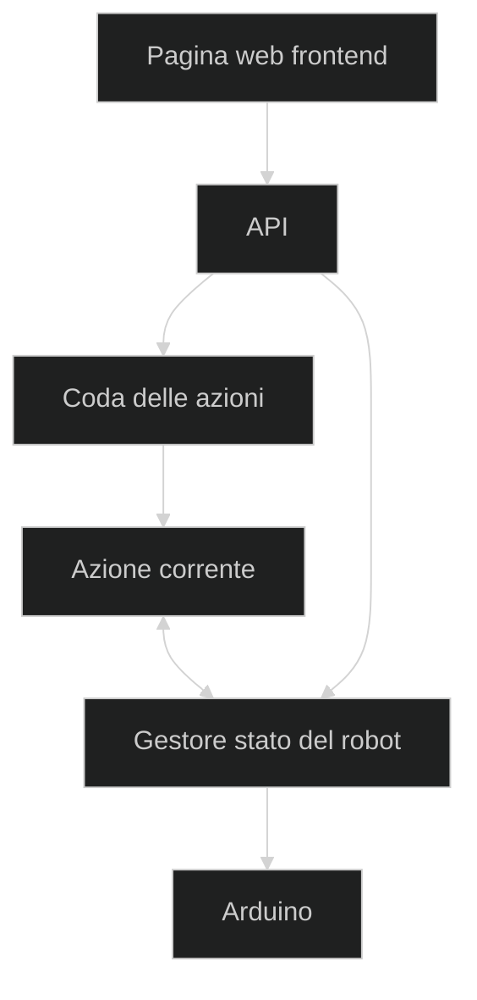

# Documentazione del backend su Raspberry

- **Pagina web frontend**: è l'interfaccia grafica per mostrare al contadino informazioni sull'orto e permettergli di impartire comandi, vedi [Frontend](./cyberorto_frontend.md). Usa l'*API* per ottenere informazioni e inviare comandi, e non fa parte del backend.
- **API**: permette alla pagina web e potenzialmente ad altri strumenti esterni di accedere ad informazioni e inviare comandi. Interagisce con il *gestore dello stato* per ricevere informazioni sul robot e il suo ambiente in tempo reale, e potenzialmente per modificare parametri o per metterlo in pausa. Interagisce anche con la *coda di azioni* per leggerla e modificarla (ad esempio aggiungendo, spostando o eliminando azioni).
- **Gestore dello stato**: riceve comandi da mandare ad *Arduino*, e tiene traccia dello stato corrente (es. l'acqua è aperta?). Questo permette non solo di esporre questi dati in tempo reale, ma garantisce anche che in caso di crash di qualche azione, il robot non finisce in uno stato inconsistente (es. l'acqua resta aperta).
- **Coda di azioni**: gestisce una coda di azioni da eseguire una dopo l'altra, tenendo traccia di eventuali pause e priorità, e fa eseguire l'*azione corrente*.
- **Azione corrente**: ogni azione esegue una sequenza di comandi (es. seminare un seme richiede andare a prendere il seme e metterlo nella terra). Le azioni devono tenere costantemente traccia del loro stato interno, perchè potrebbero venir messe in pausa o addirittura salvate su disco per essere eseguite più tardi. Pertanto tutte le azioni implementano una interfaccia comune. Esempi di azioni sono: semina, aratura, cattura immagine, ...
- **Arduino**: Arduino esegue i comandi di basso livello dettati dall'*azione corrente* e dal *gestore dello stato* (es. "muoviti alle coordinate (30,20,0)" o "apri l'acqua"). Internamente si occupa della gestione dei motori e della comunicazione con i vari sensori. Arduino è connesso al Raspberry tramite un protocollo di comunicazione, e non fa parte del backend.

### Organizzazione

Si può cominciare a lavorare subito e abbastanza indipendentemente a queste parti:
- design e implementazione delle API
- gestore dello stato con rispettive garanzie
- coda delle azioni
- interfaccia delle azioni
